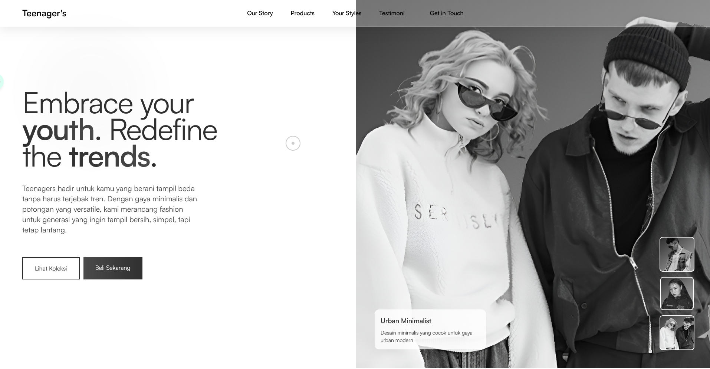
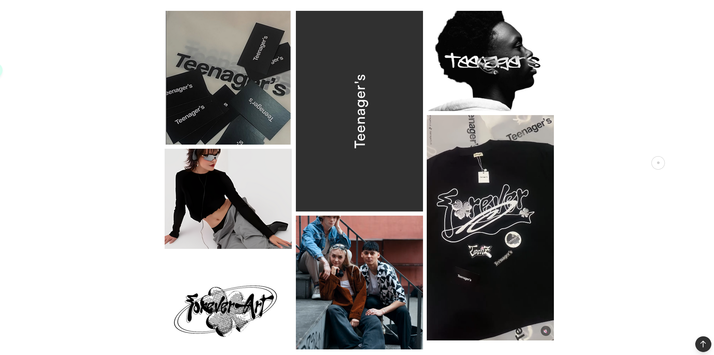
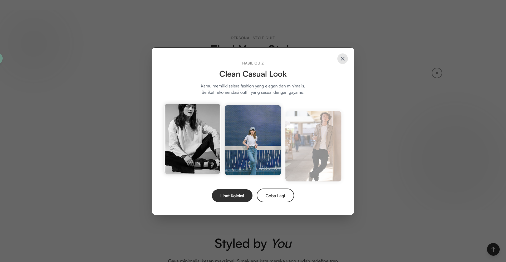
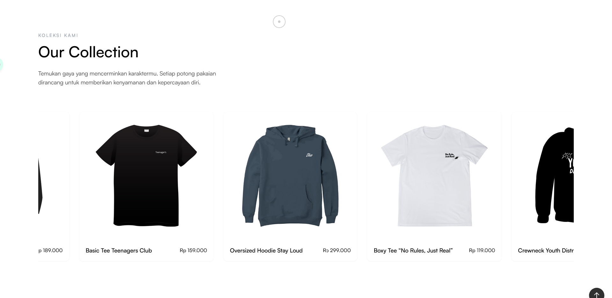

# TEENAGER'S


## 🌟 Fashion untuk Generasi Muda yang Berani Tampil Beda

Teenager's adalah brand fashion lokal yang dirancang khusus untuk generasi muda Indonesia yang ingin tampil beda dengan gaya minimalis dan potongan yang versatile. Kami menciptakan fashion untuk generasi yang ingin tampil bersih, simpel, tapi tetap lantang.

## 💼 Tentang UMKM Teenager's

Teenager's lahir dari keyakinan bahwa gaya adalah ekspresi jujur dari jiwa muda — bebas, bersih, dan berani. Dengan desain minimalis namun penuh karakter, koleksi kami dirancang untuk menghidupkan ulang arti 'simple is powerful'.

> "Simplicity isn't about having less. It's about showing more without shouting."

Kami percaya bahwa fashion bukan sekadar penampilan, melainkan cerminan dari keberanian memilih. Teenager's hadir untuk menghadirkan pilihan pakaian yang simpel, versatile, dan nyaman, agar setiap anak muda bisa meredefinisi gaya mereka dengan cara yang mudah, stylish, dan tetap autentik.

## 🚀 Konsep Website

Website Teenager's dirancang dengan pendekatan minimalis yang mencerminkan filosofi brand kami. Fokus utama adalah pengalaman pengguna yang mulus dan visual yang kuat untuk menonjolkan produk fashion. Konsep desain mengutamakan:

- **Clean & Modern**: Desain bersih dengan banyak ruang kosong untuk menonjolkan produk
- **Bold Typography**: Tipografi kuat untuk menyampaikan pesan brand
- **Interactive Elements**: Elemen interaktif untuk meningkatkan engagement pengunjung
- **Responsive Design**: Pengalaman yang optimal di semua perangkat

## 📱 Screenshot Website

### Homepage


### Gallery Showcase


### Style Quiz


### Our Collection


## ✨ Fitur Unggulan

### 1. Hero Section dengan Swiper Interaktif
Tampilan utama website dengan slider gambar produk yang responsif dan thumbnail navigasi untuk pengalaman visual yang menarik. Dilengkapi dengan efek hover pada thumbnail dan informasi slide yang muncul dengan animasi.

### 2. Weekly Picks dengan Filter Kategori
Bagian yang menampilkan pilihan produk mingguan dengan filter kategori (All, New Drop, Teen Pick, Unisex) untuk memudahkan pengguna menemukan produk yang sesuai dengan preferensi mereka. Dilengkapi dengan navigasi dan efek transisi yang halus.

### 3. Style Quiz Interaktif
Fitur quiz interaktif dengan 3 tahap pertanyaan yang membantu pengunjung menemukan gaya fashion yang paling cocok dengan kepribadian mereka. Hasil quiz memberikan rekomendasi outfit berdasarkan preferensi pengguna dengan tampilan visual yang menarik.

### 4. Our Collection Slider
Slider produk dengan navigasi intuitif yang menampilkan koleksi fashion terbaru. Setiap item produk memiliki efek hover yang elegan dan informasi harga yang jelas.

### 5. Gallery Showcase
Tampilan galeri grid yang dinamis dengan efek hover dan animasi untuk memamerkan koleksi fashion terbaru. Termasuk video dan quotes yang memperkuat identitas brand.

### 6. Vision Section dengan Quotes
Bagian yang menampilkan visi brand dengan quotes dari tim kreatif yang ditampilkan dengan animasi carousel yang elegan. Dilengkapi dengan statistik dan nilai-nilai brand yang divisualisasikan dengan menarik.

### 7. Mobile-Friendly Navigation
Menu navigasi responsif dengan animasi yang halus untuk pengalaman pengguna yang optimal di perangkat mobile. Termasuk menu hamburger yang elegan dan transisi yang mulus.

## 🛠️ Teknologi yang Digunakan

### Frontend
- **HTML5** - Struktur website modern dengan semantik yang tepat
- **CSS3** - Styling dengan fitur terbaru termasuk flexbox, grid, dan animasi
- **JavaScript ES6+** - Interaktivitas dan animasi kompleks
- **Tailwind CSS** - Framework CSS untuk desain responsif dan utilitas kelas
- **GSAP (GreenSock Animation Platform)** - Animasi yang halus dan kompleks
- **Swiper JS** - Slider dan carousel interaktif
- **AOS (Animate on Scroll)** - Animasi elemen saat scrolling

### Animasi & Efek
- **Transition & Transform** - Efek hover dan animasi yang halus
- **Opacity & Scale Animations** - Efek fade dan zoom yang elegan
- **Intersection Observer API** - Animasi berbasis viewport
- **Custom Animation Keyframes** - Animasi kustom untuk elemen tertentu

### Responsivitas
- **Mobile-First Approach** - Didesain untuk optimal di semua perangkat
- **Flexbox & CSS Grid** - Layout yang fleksibel dan responsif
- **Media Queries** - Adaptasi tampilan untuk berbagai ukuran layar
- **Dynamic Sizing** - Ukuran elemen yang menyesuaikan dengan viewport

## 🚀 Cara Menjalankan Proyek

1. Clone repository ini
```
git clone https://github.com/username/teenagers.git
```

2. Buka file `index.html` di browser Anda

3. Atau gunakan server lokal seperti Live Server di VSCode untuk pengalaman terbaik

## 📞 Kontak

- **Website**: [teenagers.id](https://tennagers.vercel.app/)
- **Email**: hello@teenagers.id
- **Instagram**: [@teenagers.us](https://www.instagram.com/teenagers.us)
- **TikTok**: [@teenagers.us](https://www.tiktok.com/@teenagers.us)
- **WhatsApp**: [+62 857-1777-1145](https://wa.me/message/MLVUKSGY2T2ML1)
- **Shopee**: [Teenager's Official Store](https://id.shp.ee/X9anrVa)

## 📍 Lokasi

Indonesia, Jakarta - 13750  
Jl. Bambu Apus No. 07

---

&copy; 2025 Teenager's. All rights reserved. 