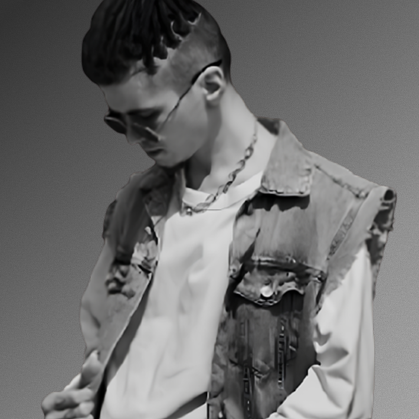

# TEENAGERS


## 🌟 Fashion untuk Generasi Muda yang Berani Tampil Beda

Teenagers adalah brand fashion lokal yang dirancang khusus untuk generasi muda Indonesia yang ingin tampil beda dengan gaya minimalis dan potongan yang versatile. Kami menciptakan fashion untuk generasi yang ingin tampil bersih, simpel, tapi tetap lantang.

## 💼 Tentang UMKM Teenagers

Teenagers lahir dari keyakinan bahwa gaya adalah ekspresi jujur dari jiwa muda — bebas, bersih, dan berani. Dengan desain minimalis namun penuh karakter, koleksi kami dirancang untuk menghidupkan ulang arti 'simple is powerful'.

> "Simplicity isn't about having less. It's about showing more without shouting."

Kami percaya bahwa fashion bukan sekadar penampilan, melainkan cerminan dari keberanian memilih. Teenagers hadir untuk menghadirkan pilihan pakaian yang simpel, versatile, dan nyaman, agar setiap anak muda bisa meredefinisi gaya mereka dengan cara yang mudah, stylish, dan tetap autentik.

## 🚀 Konsep Website

Website Teenagers dirancang dengan pendekatan minimalis yang mencerminkan filosofi brand kami. Fokus utama adalah pengalaman pengguna yang mulus dan visual yang kuat untuk menonjolkan produk fashion. Konsep desain mengutamakan:

- **Clean & Modern**: Desain bersih dengan banyak ruang kosong untuk menonjolkan produk
- **Bold Typography**: Tipografi kuat untuk menyampaikan pesan brand
- **Interactive Elements**: Elemen interaktif untuk meningkatkan engagement pengunjung
- **Responsive Design**: Pengalaman yang optimal di semua perangkat

## ✨ Fitur Unggulan

### 1. Hero Section dengan Swiper Interaktif
Tampilan utama website dengan slider gambar produk yang responsif dan thumbnail navigasi untuk pengalaman visual yang menarik.

### 2. Weekly Picks dengan Filter Kategori
Bagian yang menampilkan pilihan produk mingguan dengan filter kategori untuk memudahkan pengguna menemukan produk yang sesuai dengan preferensi mereka.

### 3. Style Quiz Interaktif
Fitur quiz interaktif yang membantu pengunjung menemukan gaya fashion yang paling cocok dengan kepribadian mereka, lengkap dengan rekomendasi produk.

### 4. Product Quick View
Fitur yang memungkinkan pengunjung melihat detail produk tanpa harus meninggalkan halaman yang sedang dilihat, meningkatkan konversi dan pengalaman berbelanja.

### 5. Gallery Showcase
Tampilan galeri yang menarik dengan efek hover dan animasi untuk memamerkan koleksi fashion terbaru dengan cara yang menarik.

### 6. Vision Section dengan Quotes
Bagian yang menampilkan visi brand dengan quotes dari tim kreatif yang ditampilkan dengan animasi yang elegan.

## 🛠️ Teknologi yang Digunakan

### Frontend
- **HTML5** - Struktur website modern
- **CSS3** - Styling dengan fitur terbaru
- **JavaScript ES6** - Interaktivitas dan animasi
- **Tailwind CSS** - Framework CSS untuk desain responsif
- **GSAP (GreenSock Animation Platform)** - Animasi yang halus dan kompleks
- **Swiper JS** - Slider dan carousel interaktif
- **AOS (Animate on Scroll)** - Animasi saat scrolling

### Animasi & Efek
- **Custom Cursor Effect** - Efek kursor kustom untuk pengalaman yang unik
- **Parallax Effects** - Efek parallax untuk dimensi visual
- **Smooth Scrolling** - Navigasi halaman yang mulus
- **Intersection Observer API** - Animasi berbasis viewport

### Responsivitas
- **Mobile-First Approach** - Didesain untuk optimal di semua perangkat
- **Flexbox & CSS Grid** - Layout yang fleksibel dan responsif
- **Media Queries** - Adaptasi tampilan untuk berbagai ukuran layar

## 📱 Screenshot



## 🚀 Cara Menjalankan Proyek

1. Clone repository ini
```
git clone https://github.com/username/teenagers.git
```

2. Buka file `index.html` di browser Anda

3. Atau gunakan server lokal seperti Live Server di VSCode

## 📞 Kontak

- **Website**: [teenagers.id](https://teenagers.id)
- **Email**: hello@teenagers.id
- **Instagram**: @teenagers.id

---

© 2023 Teenagers. All rights reserved. 